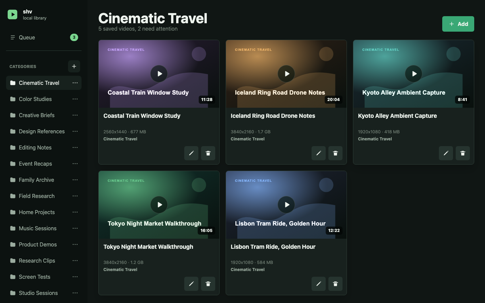
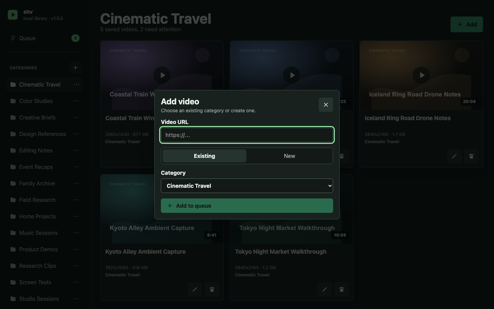
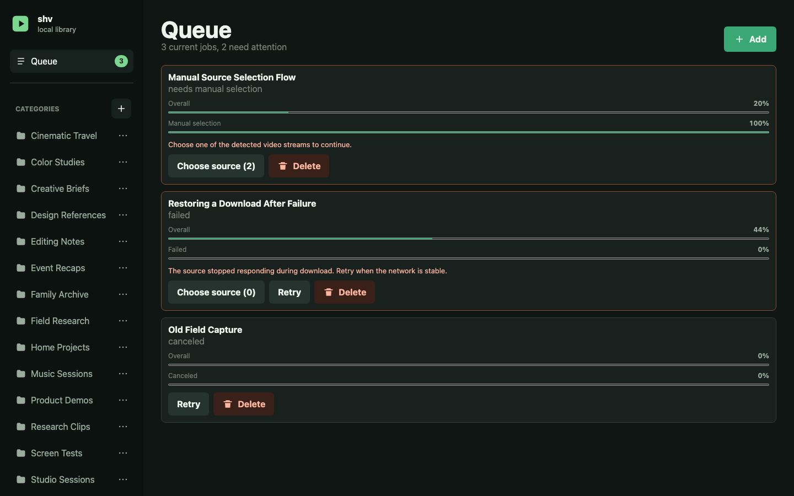

# shv — Self-hosted Video Library and Downloader

`shv` is a personal, self-hosted video library and downloader for one trusted user on a home LAN or VPN. It stores videos in local category folders and supports direct video files, HLS, DASH, browser-assisted source capture, and YouTube through `yt-dlp`.

The application runs with Docker Compose and combines a React web UI, a TypeScript and Express backend, SQLite metadata, FFmpeg media processing, and a Chromium helper extension. It has no built-in accounts and does not support public-internet deployment.

## Features

- Save videos into a local category-based library.
- Download direct video files, HLS streams, and DASH streams.
- Use a Chromium helper extension for pages where the final media URL appears only during playback.
- Track queued, running, failed, canceled, and completed downloads.
- Stream saved videos back from the local library with thumbnail and metadata support.

## Interface Preview







## Important Safety Notes

- Use `shv` only for content you own, created, are allowed to download, or are otherwise legally permitted to save.
- `shv` does not support DRM bypass, key extraction, paywall bypass, or circumvention of protected media systems.
- The application has no built-in authentication or authorization. Do not expose it directly to the public internet.
- Docker Compose binds to `0.0.0.0` by default so devices on a trusted LAN can reach the app.

See [SECURITY.md](SECURITY.md) for security, cookie, browser-extension, and reporting notes.

## Quick Start

Run the app with Docker Compose:

```bash
docker compose up --build
```

For detached mode:

```bash
docker compose up -d --build
```

Then open:

```text
http://localhost:8080
```

Persistent host folders are mounted under `./data`:

- `./data/library` -> `/data/library`: category folders and downloaded videos.
- `./data/app` -> `/data/app`: SQLite database, thumbnails, Chromium profile state, diagnostics, and cookies used by download helpers.
- `./data/work` -> `/work`: temporary active download and media-processing files.

## Releases

Prebuilt release images are published to GHCR as `ghcr.io/zenderg/shv:vX.Y.Z`.

Release process and deployment snippets are documented in [docs/releases.md](docs/releases.md).

## Local Checks

Local commands are available for checks and tests:

```bash
npm test
npm run typecheck
npm run build
```

Application startup should remain Docker Compose based.

## Browser Extension

Manual source selection uses a local Chromium browser extension. The running app serves the current extension package at:

```text
http://127.0.0.1:8080/extension/shv-source-helper.zip
http://127.0.0.1:8080/extension/shv-source-helper-dev.zip
```

Download the extension package from the same app URL you use in the browser. The app expects the production extension
profile by default, even on localhost or private LAN addresses. Set `SOURCE_EXTENSION_PROFILE=dev` to use the dev
package/id alongside the production extension in the same browser profile. With Docker Compose, use
`SOURCE_EXTENSION_PROFILE=dev docker compose up` when you need that development profile.

See [docs/browser-extension.md](docs/browser-extension.md) for installation, behavior, and troubleshooting details.

## Documentation

- [docs/product.md](docs/product.md): product scope, non-goals, and source-of-truth behavior.
- [docs/decisions.md](docs/decisions.md): durable rationale, rejected alternatives, and historical context.
- [docs/architecture.md](docs/architecture.md): runtime layout, module ownership, queue behavior, and media pipeline boundaries.
- [docs/browser-extension.md](docs/browser-extension.md): helper extension installation and capture behavior.
- [docs/development.md](docs/development.md): local checks, Docker/Codex notes, seed data, and diagnostics.
- [docs/releases.md](docs/releases.md): release workflow, GHCR image tags, and deployment snippet.
